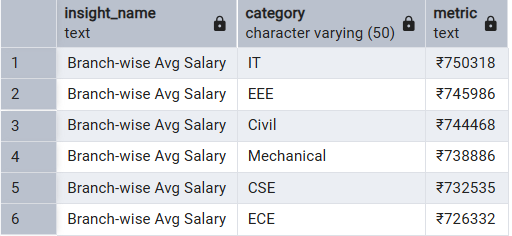
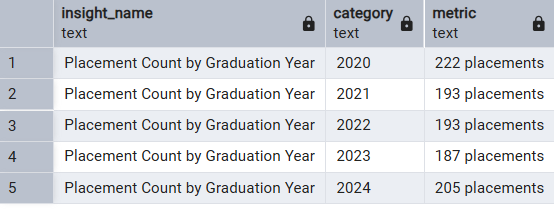
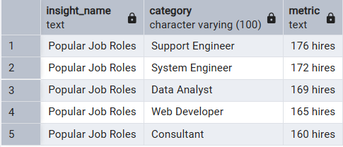
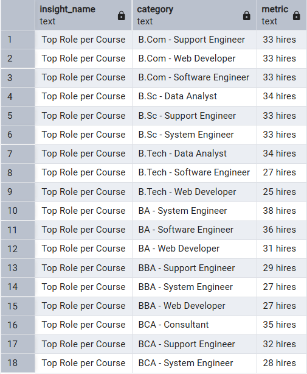
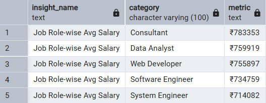

# 🎓 Placement Data Analysis – SQL Capstone Project

## 📌 Project Overview

This project focuses on analyzing **placement data** using SQL.  
The main objective is to extract **actionable insights** for students, colleges, and recruiters by studying trends in job roles, companies, salaries, and branch performance.

The project simulates a **real-world database** and applies SQL queries for:

- **Data Analysis**
- **Business Intelligence**
- **Decision Making**

---

## 🗂️ Database Structure

### Main Table

- **`placements`**
  - Stores placement details like Student, Branch, Company, Role, Salary, City, and Year.

### Summary / Insight Tables

1. **`avg_salary_by_branch`** → Combined insights in one table
2. **`placements_by_graduation_year`** → Average salary grouped by branch
3. **`popular_roles`** → Placement trends by year
4. **`top_roles_per_course`** → Most common job roles offered
5. **`Job Role-wise Avg Salary`** → job role wise Average Salary

---

## 📊 Key Insights Generated

1. **Top Companies** hiring most students.
2. **Average Salary by Branch** to compare performance of courses (e.g., CSE, AIML, ECE, MECH).
3. **Placement Rate by Graduation Year** to check trends over multiple years.
4. **City-wise Hiring & Salary Trends** to identify high-paying or high-hiring cities.
5. **Popular Job Roles** across the dataset.
6. **Branch-wise Performance** in terms of placements & salary.
7. **Top 3 Job Roles per Course** for detailed specialization insights.

---

## 🛠️ Tools & Technologies Used

- **SQL (MySQL / PostgreSQL / SQLite)** – Core query execution
- **ER Diagrams** – Data modeling and visualization
- **Normalization** – Clean data design
- **Aggregate Functions & Joins** – For insights and reporting
- **CTEs & Subqueries** – To simplify analysis

#

### 🔹 1. Average Salary by Branch

```
SELECT
    'Branch-wise Avg Salary' AS insight_name,
    branch AS category,
    CONCAT('₹', ROUND(AVG(salary_inr))) AS metric
FROM placements
GROUP BY branch
ORDER BY AVG(salary_inr) DESC;
```

## OUTPUT



### 🔹 2.placements_by_graduation_year

```
SELECT
    'Placement Count by Graduation Year' AS insight_name,
    graduation_year::TEXT AS category,
    CONCAT(COUNT(*), ' placements') AS metric
FROM placements
GROUP BY graduation_year
ORDER BY graduation_year;
```

## OUTPUT



### 🔹 3.popular_roles

```
SELECT
    'Popular Job Roles' AS insight_name,
    job_role AS category,
    CONCAT(COUNT(*), ' hires') AS metric
FROM placements
GROUP BY job_role
ORDER BY COUNT(*) DESC
LIMIT 5;
```

## OUTPUT



### 🔹 4.top_roles_per_course

```
SELECT
    'Top Role per Course' AS insight_name,
    CONCAT(course, ' - ', job_role) AS category,
    CONCAT(role_count, ' hires') AS metric
FROM (
    SELECT
        course,
        job_role,
        COUNT(*) AS role_count,
        RANK() OVER (PARTITION BY course ORDER BY COUNT(*) DESC) AS role_rank
    FROM placements
    GROUP BY course, job_role
) sub
WHERE role_rank <= 3;

```

## OUTPUT



### 🔹 5.Job Role-wise Avg Salary

```
SELECT
    'Job Role-wise Avg Salary' AS insight_name,
    job_role AS category,
    CONCAT('₹', ROUND(AVG(salary_inr))) AS metric
FROM placements
GROUP BY job_role
ORDER BY AVG(salary_inr) DESC
LIMIT 5;


```

## OUTPUT


